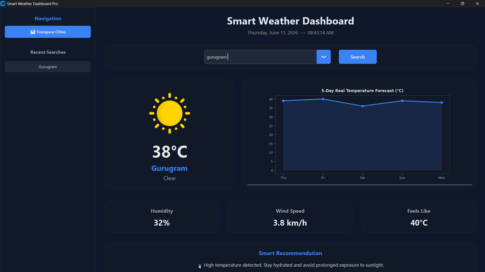

# 🌦️ Weather Dashboard Pro

A modern, dark-themed desktop weather intelligence application built with Python and CustomTkinter. Weather Dashboard Pro provides real-time weather insights, interactive forecast analytics, smart recommendations, and multi-city comparison capabilities through a clean and responsive user interface.

---

## 📌 Overview

Weather Dashboard Pro transforms raw weather data into an intuitive visual experience. The application combines real-time weather monitoring, historical search tracking, forecast visualization, and intelligent recommendations into a single desktop solution.

Designed with a modular architecture, the project demonstrates practical implementation of API integration, GUI development, data visualization, and user-centric software design.

---

## ✨ Features

### 🌍 Real-Time Weather Information

* Fetch current weather conditions for cities worldwide
* Display temperature, humidity, wind speed, and feels-like temperature
* Instant weather updates through live API integration

### 🔍 Smart City Search

* Auto-suggest search functionality
* Dynamic city filtering while typing
* Faster and more user-friendly city selection

### 📚 Recent Search History

* Automatically stores unique city searches
* One-click access to previously searched locations
* Dedicated sidebar navigation panel

### ⚖️ Multi-City Comparison

* Compare weather conditions between two cities simultaneously
* Dedicated comparison window
* Side-by-side weather metrics visualization

### 📈 Interactive Forecast Analytics

* Dynamic 5-day temperature forecast visualization
* Built using Matplotlib
* Easy-to-understand trend analysis

### 🎨 Modern User Interface

* Dark-themed professional dashboard
* Responsive vertical layout
* Smooth and intuitive navigation experience

### 🌤️ Weather Animations

* Floating weather profile animations
* Enhanced visual experience through mathematical motion effects

### 💡 Smart Recommendations

* Weather-aware activity suggestions
* Context-based outdoor recommendations
* Temperature and weather severity analysis

### 🕒 Live Date & Time

* Real-time clock integration
* Automatic date and time updates
* Dashboard header synchronization

---

## 🖼️ Application Preview



Example:


---

## 🛠️ Technology Stack

| Technology    | Purpose                      |
| ------------- | ---------------------------- |
| Python 3.12+  | Core programming language    |
| CustomTkinter | Modern desktop GUI framework |
| Matplotlib    | Forecast trend visualization |
| Pillow (PIL)  | Weather icon processing      |
| Requests      | Weather API communication    |

---

## 📂 Project Structure

```text
WEATHER DASHBOARD PRO/
│
├── app.py
├── README.md
├── requirements.txt
├── .gitignore
│
├── assets/
│   ├── sunny.png
│   ├── cloudy.png
│   ├── rain.png
│   └── ...
│
├── modules/
│   ├── weather_api.py
│   └── recommendations.py
│
└── ui/
    ├── dashboard.py
    ├── weather_card.py
    ├── components.py
    ├── charts.py
    ├── search_bar.py
    ├── dialogs.py
    └── compare.py
```

---

## ⚙️ Installation

### 1️⃣ Clone the Repository

```bash
git clone https://github.com/yourusername/weather-dashboard-pro.git
cd weather-dashboard-pro
```

### 2️⃣ Install Dependencies

```bash
pip install customtkinter matplotlib pillow requests
```

Or install directly from requirements.txt:

```bash
pip install -r requirements.txt
```

### 3️⃣ Run the Application

```bash
python app.py
```

---

## 📊 Key Learning Outcomes

This project demonstrates:

* API Integration using REST services
* GUI Development with CustomTkinter
* Data Visualization with Matplotlib
* Modular Software Architecture
* Event-Driven Programming
* User Experience Design
* Python Application Development

---

## 🚀 Future Enhancements

* Weather maps integration
* Air Quality Index (AQI) monitoring
* Weather alerts and notifications
* Theme customization support
* Data export functionality
* Location-based automatic weather detection
* Weekly and monthly forecasting

---

## 🤝 Contributing

Contributions, suggestions, and feature requests are welcome.

1. Fork the repository
2. Create a feature branch
3. Commit your changes
4. Open a Pull Request

---

## 👨‍💻 Author

**Saksham Yadav**

Computer Science Engineering Student | Python Developer | Data & AI Enthusiast

---

## 📜 License

This project is licensed under the MIT License.

Copyright © 2026 Saksham Yadav

Permission is hereby granted, free of charge, to any person obtaining a copy of this software and associated documentation files to deal in the Software without restriction, including without limitation the rights to use, copy, modify, merge, publish, distribute, sublicense, and/or sell copies of the Software.

THE SOFTWARE IS PROVIDED "AS IS", WITHOUT WARRANTY OF ANY KIND, EXPRESS OR IMPLIED, INCLUDING BUT NOT LIMITED TO THE WARRANTIES OF MERCHANTABILITY, FITNESS FOR A PARTICULAR PURPOSE AND NONINFRINGEMENT.
